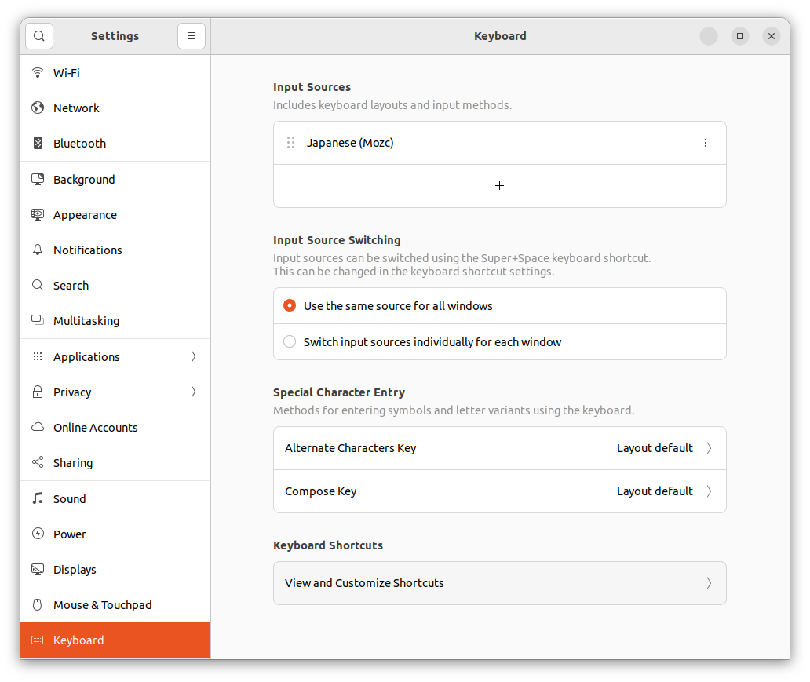
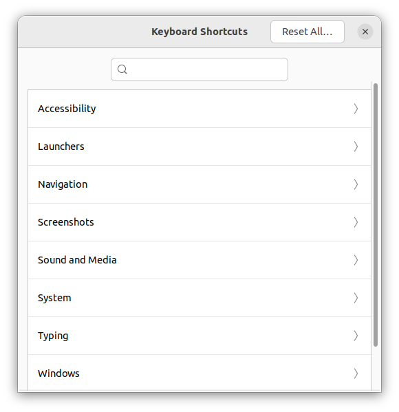
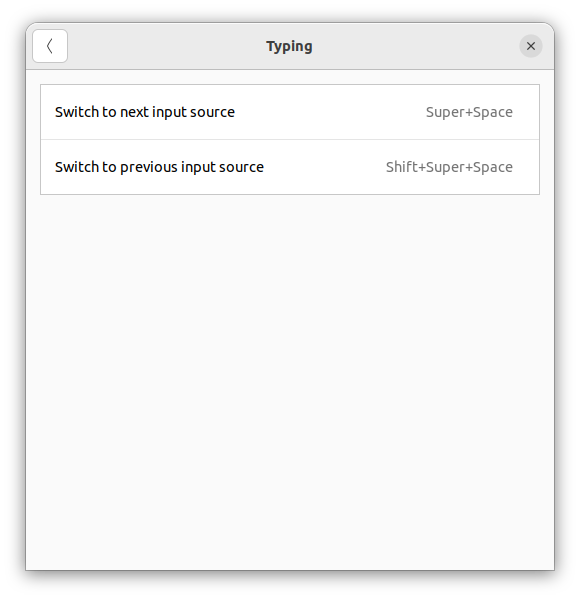
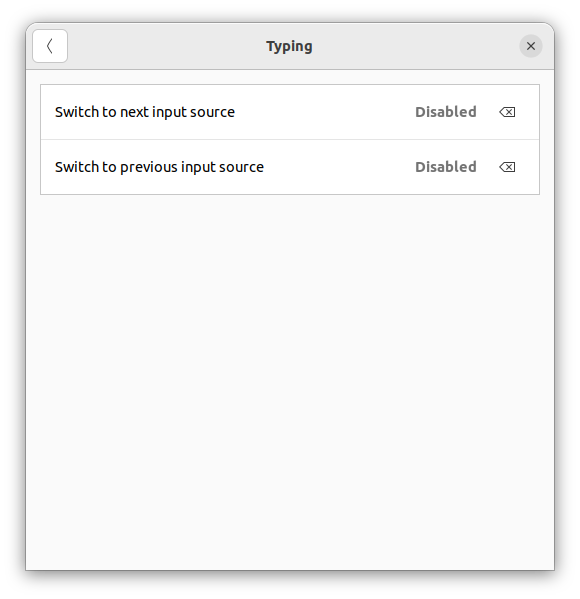

# Ubuntu 22.04で日本語入力にする方法
## JISキーボードの場合
### Mozcのインストール
Terminalを開き、以下のコマンドでMozc（Google 日本語入力のオープンソース版）をインストールし、PCを再起動する。
```
sudo apt install ibus-mozc
sudo reboot
```

### 半角/全角 キーでの日本語/英語入力切り替え
画面右上のWifiやバッテリー残量表示がある部分をクリックし、**Settings**を開く。


Settings左サイドバーの一番下にある**Keyboard**をクリックする。

**Input Sources**に**Japanese (Mozc)**が追加されていることを確認し、一番下にある**View and Customize Shortcuts**ボタンをクリックする。



**Typing**をクリックする。



**Switch to next input source**をクリックする。



**Back Space**キーを押して、**Set**ボタンをクリックすれば完了！

設定が以下のように変わっていることを確認する。



これで、全角/半角キーで日本語ローマ字入力と英語入力が切り替えできるようになります。